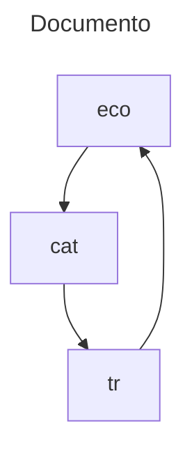

# Taller 6

## Agenda

1. Preliminares
2. Tuberías nombradas
3. Proceso demonios
4. Registro de eventos (log)
5. Servicios

## Preliminares

Abra una terminal. Abra el directorio de repositorio y de los talleres

```
cd <repositorio-enlace>
cd talleres
```

Descargue el taller en formato zip, descomprimalo.

```
wget https://github.com/jfcmacro/TallerSO_06/archive/refs/heads/master.zip
unzip master.zip
rm master.zip
```

Mire la estructura actual

```
tree .
```

Entre al directorio del taller

```
cd TallerSO_06-master
```

Adicione los ficheros

```bash
git add README.md .gitignore
```

Adicione los ficheros del proyecto, esto adiciona todos ficheros del taller.

```bash
find . -name *.c -exec git add {} \;
find . -name .keep -exec git add {} \;
find . -name makefile -exec git add {} \;
```

Acometa (*commit*) el proyecto.

```
git commit -m "Iniciando el Taller 06"
git push
```

## Tuberías nombradas

### Linux

* [signal(7)](https://man7.org/linux/man-pages/man7/signal.7.html)
* [signal(2)](https://man7.org/linux/man-pages/man2/signal.2.html)
* [kill(2)](https://man7.org/linux/man-pages/man2/kill.2.html)
* [alarm(2)](https://man7.org/linux/man-pages/man2/alarm.2.html)
* [Manejar señal ejemplo](./senales-eventos/linux/manejar-senal.c)

Abrir una terminal y compilar el programa `manejar-senal.c`. 

> Explicación. Profesor senales

**[Ejercicio 1].** (Carpeta: `./senales-eventos/linux/` Nombre: `senales.c`)

Copie el fichero:

```bash
cp manejar-senal.c manejar-senal2.c
```

Adicione las siguiente señales al programa y el manejador de senales debe indicar cual es la señal capturada:  `SIGHUP`, `SIGQUIT`

No olvide modificar el fichero `makefile`

> Explicación. Proceso de compilación. Compilación por partes

* [sigaction(2)](https://man7.org/linux/man-pages/man2/sigaction.2.html)

**[Ejercicio 2].** (Carpeta: `./senales-eventos/linux/` Nombre: `manejar-senal2.c`)

Copie el fichero:

```bash
cp manejar-senal.c manejar-senal2.c
```

El programa `manejar-senal2.c` tiene un problema con las señales que son ignoradas, efectivamente son ignoradas, instale capture la señales que se ignora en el proceso.

No olvide modificar el fichero `makefile`

## Comunicación de procesos

### Linux

* [pipe(2)](https://man7.org/linux/man-pages/man2/pipe.2.html)
* [pipe2(2)](https://man7.org/linux/man-pages/man2/pipe.2.html)
* [dup](https://man7.org/linux/man-pages/man2/dup.2.html)
* [dup2](https://man7.org/linux/man-pages/man2/dup.2.html)

* [Conectar procesos](./conectar-procesos/linux/conectar-procesos.c)

> Explicación tuberías en Linux

**[Ejercicio 3]**. (Carpeta: `./conectar-procesos/linux/` Nombre: `conectar-procesos2.c`)

Copie el fichero:

```bash
cp conectar-proceso.c conectar-proceso2.c
```

Modifique el programa para utilizar `dup2`.

**[Ejercicio 4]**. (Carpeta: `./conectar-procesos/linux/` Nombre: `eco.c`)

* Formato: `eco <nombre-fichero> <cadena-traduccion> <linea-modulo-a-eliminar>`
* Descripción: Implementar un programa que hace echo. La idea es que el programa`eco` abre un fichero que se le pasa como el primer argumento, y le pasa cada linea a `cat`, este redirige la salida al proceso de `tr` donde el segundo parámetro es la transformación, y la salida de esta es pasada a eco, que se encarga de imprimir cada linea módulo `<linea-modulo-a-eliminar>`.



### Windows

* [CreatePipe](https://learn.microsoft.com/es-es/windows/win32/api/namedpipeapi/nf-namedpipeapi-createpipe)
* [CreateProcess](https://learn.microsoft.com/es-es/windows/win32/api/processthreadsapi/nf-processthreadsapi-createprocessa)
* [conectar-procesos.c](./conectar-procesos/windows/conectar-procesos.c)

> Explicar de tuberías en Windows

**[Ejercicio 5]**. (Carpeta: `./conectar-procesos/windows/` Nombre: `eco.c`)

* Formato: `eco <nombre-fichero> <cadena-traduccion> <linea-modulo-a-eliminar>`
* Descripción: Implementar un programa que hace echo. La idea es que el programa`eco` abre un fichero que se le pasa como el primer argumento, y le pasa cada linea a `cat`, este redirige la salida al proceso de `tr` donde el segundo parámetro es la transformación, y la salida de esta es pasada a eco, que se encarga de imprimir cada linea módulo `<linea-modulo-a-eliminar>`.


### 